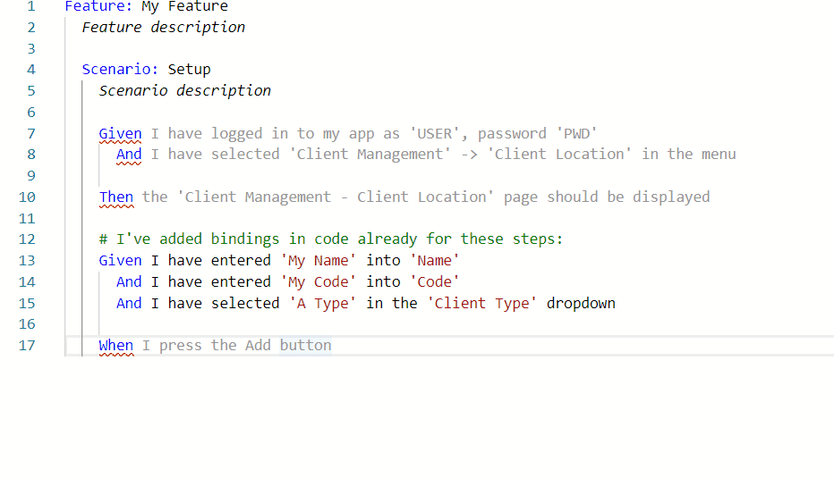

>
> This repo is 'frozen', in that no active development is taking place. It has been effectively superseded by the [VSCode Extension](https://github.com/autostep/AutoStep.VsCode).
>

# AutoStep.Editor

This repository contains the Editor and User Interface for writing and managing AutoStep tests.

This project uses the AutoStep Core functionality library for compilation and linking (https://github.com/autostep/AutoStep).

The UI is built using Blazor, and the underlying 
code editor is Monaco.

Work is still in the early stages, but here's an example of the live syntax highlighting and compilation in action:



## Building the Editor

To build the editor, you will need the .NET SDK Version 3.1.100.

You will also need a node installation (for running webpack), version 12+.

Once you've cloned the repository, you should just be able to build and then run the server project:

```bash
dotnet build
dotnet run --project .\src\Server\
```

The build process wil include a webpack build of 
the Monaco and application bundles that are needed.

Navigate to http://localhost:5000 in your browser,
and you should hopefully see the editor!

## Cross Platform

The editor should build and run on all supported .NET Core supported platforms, but please let me know if you have trouble on Linux or Mac.
